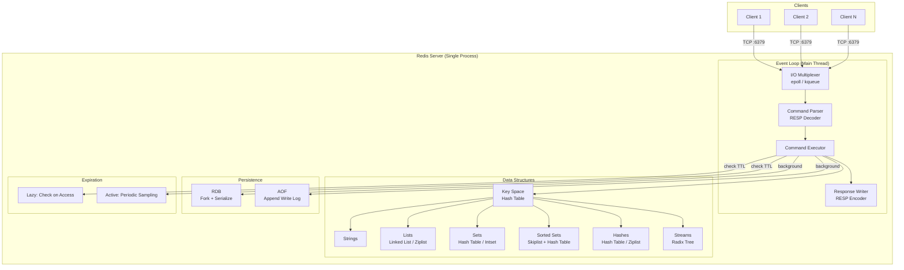

# Redis Deep Dive

## Architecture

Redis follows a simple but powerful architecture: a single-threaded event loop that multiplexes thousands of client connections, executing commands against in-memory data structures with optional disk persistence.



## Key Internals

### The Event Loop

Redis uses a custom event loop (`ae` library in the source code) built on top of the OS's I/O multiplexing primitives — `epoll` on Linux, `kqueue` on BSD/macOS, or `select` as a portable fallback. The loop:

1. Calls the multiplexer to get a list of sockets with pending I/O
2. Reads complete commands from client input buffers
3. Executes each command (single-threaded, no interleaving)
4. Writes responses to client output buffers
5. Handles time events (expiration, persistence triggers)

This design means Redis can handle tens of thousands of concurrent connections with a single thread because it never blocks waiting on a single client. The bottleneck is CPU time spent executing commands, not I/O wait.

Recent versions (6.0+) introduced optional I/O threads that can parallelize network read/write operations, but command execution remains strictly single-threaded.

### RESP Protocol

RESP (Redis Serialization Protocol) is the wire format for client-server communication. It's text-based, human-readable, and fast to parse because it uses prefix lengths rather than delimiters for binary data.

**Key RESP2 types:**

| Type | First Byte | Example |
|------|-----------|---------|
| Simple String | `+` | `+OK\r\n` |
| Error | `-` | `-ERR unknown command\r\n` |
| Integer | `:` | `:1000\r\n` |
| Bulk String | `$` | `$5\r\nhello\r\n` |
| Array | `*` | `*2\r\n$3\r\nGET\r\n$3\r\nkey\r\n` |
| Null | `$-1` | `$-1\r\n` |

**Client request format:** Commands are always sent as arrays of bulk strings:
```
*3\r\n$3\r\nSET\r\n$5\r\nmykey\r\n$7\r\nmyvalue\r\n
```

This encodes `SET mykey myvalue`.

### The Key Space

Redis organizes all data in a flat key space — a hash table mapping string keys to value objects. Each value object (`robj` in the source) carries:

- The object's type (string, list, set, etc.)
- The encoding (the internal representation: raw, int, ziplist, skiplist, etc.)
- A reference count for memory management
- An LRU/LFU timestamp for eviction

Redis uses two hash tables internally for incremental rehashing — when the table grows, entries are migrated gradually across event loop iterations to avoid latency spikes.

### Data Structure Encodings

Redis optimizes memory by choosing compact encodings for small collections:

| Type | Small Encoding | Large Encoding |
|------|---------------|----------------|
| String | Integer (if numeric) | SDS (Simple Dynamic String) |
| List | Listpack (≤128 entries) | Quicklist (linked list of listpacks) |
| Set | Intset (all integers, ≤512) | Hash table |
| Sorted Set | Listpack (≤128 entries) | Skiplist + hash table |
| Hash | Listpack (≤128 entries) | Hash table |

The system transparently upgrades from compact to full encoding when thresholds are exceeded.

### Expiration & Eviction

**TTL tracking:** Keys with expiration are stored in a separate dictionary mapping key → expiration timestamp.

**Lazy expiration:** Every time a key is accessed, Redis checks if it's expired. If so, it's deleted before the command executes.

**Active expiration:** A periodic task (runs 10 times/second by default) samples random keys from the expires dictionary. If >25% of sampled keys are expired, it repeats immediately. This probabilistic approach bounds both memory waste and CPU usage.

**Eviction policies** (when `maxmemory` is reached):
- `noeviction`: Return errors for writes
- `allkeys-lru`: LRU eviction across all keys
- `volatile-lru`: LRU eviction only among keys with TTL
- `allkeys-lfu`: Least Frequently Used across all keys
- `allkeys-random`: Random eviction
- `volatile-ttl`: Evict keys closest to expiration

### Persistence: RDB Snapshots

RDB creates a point-in-time binary dump of the entire dataset:

1. Redis forks the process (copy-on-write semantics)
2. The child process serializes all key-value pairs to a temporary file
3. On completion, the file atomically replaces the old RDB file

**Tradeoffs:** Compact file, fast recovery, but you lose all writes since the last snapshot. Fork can cause latency spikes on large datasets due to memory page copying.

### Persistence: AOF (Append-Only File)

AOF logs every write command in RESP format:

1. Each write command is appended to an in-memory AOF buffer
2. The buffer is flushed to disk based on the `fsync` policy:
   - `always`: fsync after every command (safest, slowest)
   - `everysec`: fsync once per second (good compromise)
   - `no`: let the OS decide (fastest, least safe)
3. AOF rewrite (compaction) periodically rewrites the file using the current dataset state

**Tradeoffs:** Better durability (at most 1 second of data loss with `everysec`), but larger files and slower restart compared to RDB.

### Pub/Sub

Redis Pub/Sub implements a fire-and-forget messaging system:

- Clients `SUBSCRIBE` to channels (or patterns with `PSUBSCRIBE`)
- Other clients `PUBLISH` messages to channels
- The server fans out messages to all subscribed connections
- Messages are NOT persisted — if no subscriber is listening, the message is lost
- Subscribed connections enter a special mode where they can only execute subscribe/unsubscribe commands

### Pipelining

Clients can send multiple commands without waiting for individual responses:

1. Client writes N commands in a single TCP write
2. Server processes all N commands sequentially
3. Server writes all N responses back
4. Client reads all N responses

This eliminates the round-trip latency between each command, dramatically improving throughput for batch operations (from ~100K ops/sec to 500K+ ops/sec on typical hardware).

## Resources

### Official Documentation
- [Redis Documentation](https://redis.io/docs/latest/) — Comprehensive official docs covering commands, data types, and operations
- [RESP Protocol Specification](https://redis.io/docs/latest/develop/reference/protocol-spec/) — Complete wire protocol specification
- [Redis Persistence](https://redis.io/docs/latest/operate/oss_and_stack/management/persistence/) — Official guide on RDB and AOF persistence mechanisms

### Articles
- [Redis Explained](https://architecturenotes.co/p/redis) — Architecture Notes deep dive covering topologies, persistence, and process forking (2022)
- [The Engineering Wisdom Behind Redis's Single-Threaded Design](https://community.aws/content/2tfQijlXleV5iM6hDkSGkMJlpcd/the-engineering-wisdom-behind-redis-s-single-threaded-design) — AWS Community article on why single-threaded works (2025)
- [Redis Internals: Understanding It by Rebuilding It](https://skshmgpt.medium.com/redis-internals-understanding-it-by-rebuilding-it-e16d6dd102e2) — Walk-through of rebuilding Redis from scratch (2025)

### Videos
- [Redis Crash Course](https://www.youtube.com/watch?v=Hbt56gFj998) — Traversy Media introduction covering core concepts and commands
- [System Design: Why is single-threaded Redis so fast?](https://www.youtube.com/watch?v=5TRFpFBccQM) — ByteByteGo explanation of Redis performance

### Source Code
- [redis/redis](https://github.com/redis/redis) — Official Redis source (C). Key files: `server.c` (event loop), `t_string.c`, `t_list.c`, `t_set.c`, `t_zset.c` (data structures), `aof.c`, `rdb.c` (persistence)
- [RESP3 Specification](https://github.com/antirez/RESP3/blob/master/spec.md) — Antirez's RESP3 protocol spec with design rationale
- [redis/redis-specifications](https://github.com/redis/redis-specifications/blob/master/protocol/RESP2.md) — Formal RESP2 protocol specification
