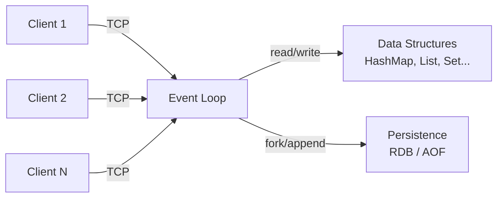

# Redis Overview

## What is Redis?

Redis (Remote Dictionary Server) is an open-source, in-memory data structure store used as a database, cache, message broker, and streaming engine. Created by Salvatore Sanfilippo in 2009, it keeps the entire dataset in memory for sub-millisecond latency while supporting optional persistence to disk. Redis is single-threaded by design — all commands execute sequentially on one thread — which eliminates locking and makes it extremely fast and simple to reason about.

## Core Concepts

- **In-Memory Storage**: All data lives in RAM. Reads and writes are O(1) hash table lookups for simple keys, giving microsecond-level response times.
- **Single-Threaded Event Loop**: One main thread processes all commands using non-blocking I/O multiplexing (epoll/kqueue). No locks, no context switches, no race conditions.
- **RESP Protocol**: The Redis Serialization Protocol is a simple text-based wire protocol. Clients send commands as arrays of bulk strings; the server replies with typed responses (strings, integers, arrays, errors).
- **Data Structures**: Redis is not just key-value — it provides strings, lists, sets, sorted sets, hashes, streams, bitmaps, and HyperLogLogs as first-class citizens.
- **Persistence**: Two mechanisms — RDB (point-in-time snapshots) and AOF (append-only log of every write) — allow data to survive restarts.
- **TTL & Expiration**: Keys can have a time-to-live. Expired keys are removed via lazy deletion (on access) and periodic active expiration (background sampling).
- **Pub/Sub**: Built-in publish/subscribe messaging allows decoupled communication between clients through named channels.

## How It Works (High Level)

Redis runs a tight event loop on a single thread. When a client connects (over TCP, default port 6379), the connection socket is registered with the OS's I/O multiplexer. The event loop continuously polls for ready sockets, reads complete commands from client buffers, executes them against in-memory data structures, and writes responses back — all without blocking.

Commands are atomic because they run sequentially on a single thread. There is no need for transactions or locks for individual operations. For multi-step atomic operations, Redis provides `MULTI/EXEC` transactions and Lua scripting.

Persistence happens in the background. RDB snapshots fork the process and serialize the dataset to a compact binary file. AOF logs every write command in RESP format, which can be replayed on restart to reconstruct state. Both can be used together for a balance of performance and durability.

## Use Cases

- **Caching**: Store frequently accessed data in memory to reduce database load (session data, API responses, query results)
- **Rate Limiting**: Use atomic counters with TTL to implement sliding window or token bucket rate limiters
- **Real-Time Leaderboards**: Sorted sets provide O(log N) ranked inserts and range queries
- **Message Queues**: Lists with blocking pops (BLPOP/BRPOP) or Streams for reliable message delivery
- **Session Storage**: Fast read/write with automatic expiration makes Redis ideal for web sessions
- **Pub/Sub Messaging**: Decouple producers and consumers for real-time notifications and event broadcasting

## Tradeoffs

| Strengths | Weaknesses |
|-----------|------------|
| Sub-millisecond latency | Dataset must fit in memory (RAM-bound) |
| Rich data structures beyond simple KV | Single-threaded limits CPU-bound throughput |
| Atomic operations without explicit locking | Persistence can cause latency spikes (RDB fork, AOF fsync) |
| Simple protocol, easy to implement clients | No built-in query language (no SQL, no secondary indexes without modules) |
| Battle-tested at massive scale | Data loss window between persistence points |
| Flexible persistence options | Replication is asynchronous (eventual consistency) |

## What You'll Learn

By implementing mini-redis, you'll gain hands-on mastery of:

- **Wire protocol design**: parsing and encoding a real binary/text protocol (RESP) — the same skill behind implementing any network protocol from a spec.
- **Single-threaded concurrency**: how one thread + an event loop can outperform lock-heavy multithreaded designs, and why atomicity comes for free.
- **Non-blocking I/O**: using selectors/channels to multiplex thousands of connections without a thread per client.
- **Expiration strategies**: lazy vs. active deletion, and the tradeoffs of each under memory pressure.
- **Data-structure internals**: how strings, lists, sets, and hashes are represented and type-checked in a single keyspace.
- **Persistence & durability**: append-only logging (AOF) vs. snapshotting (RDB), fsync policies, and crash recovery.
- **Pub/sub & transactions**: fan-out messaging and how MULTI/EXEC provide atomic batches without locks.

## Benefits of Building This

- **Demystify your cache**: you'll stop treating Redis as a black box and reason precisely about latency, eviction, and durability tradeoffs in production.
- **Sharper system-design instincts**: caching, rate limiting, and leaderboards become obvious tools because you understand the primitives underneath them.
- **Protocol fluency**: implementing RESP transfers directly to debugging or building any TCP protocol (databases, brokers, custom services).
- **Interview & design leverage**: "I built a Redis clone with AOF and pub/sub" is a concrete, senior-to-staff signal that you understand storage systems end to end.
- **Better incident response**: knowing how persistence forks and fsync cause latency spikes makes you the person who can diagnose a stalled cache under load.
